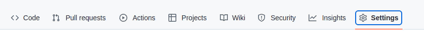
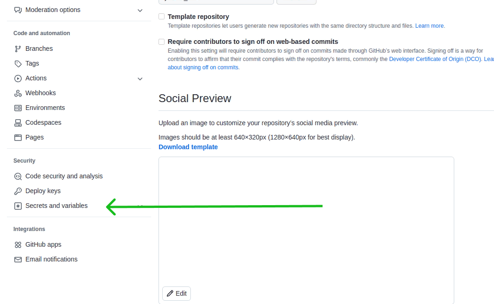
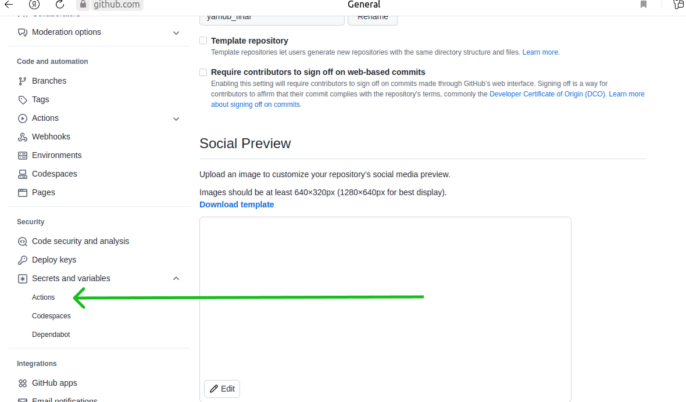
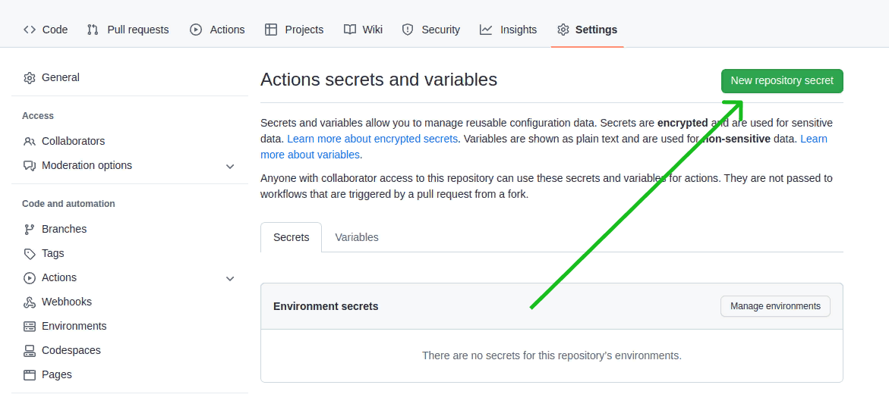
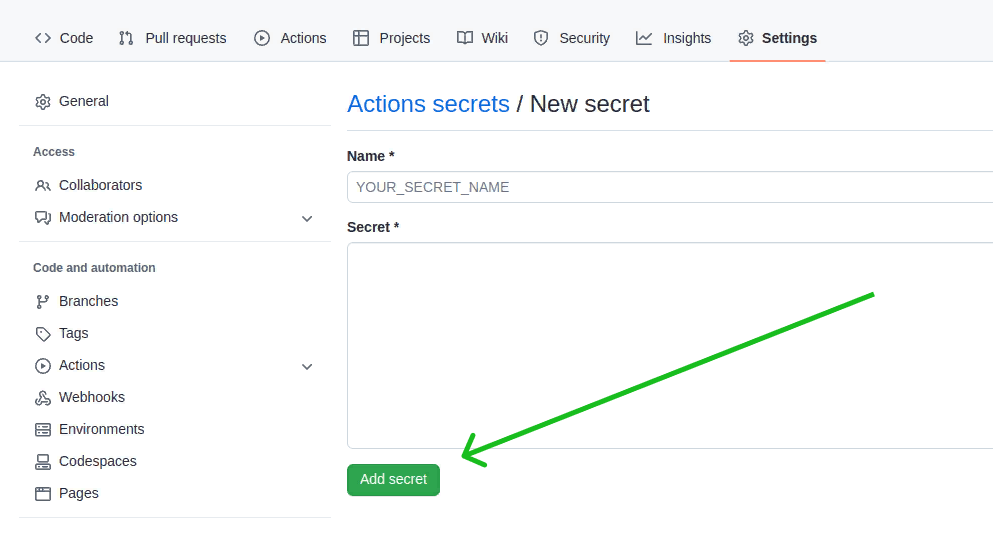

# yamdb_final

# Учебный проект #


Проект доступен по:
```
http://84.201.155.156/api/v1/
```
```
http://otzovik.sytes.net/api/v1/
```
Описание API проекта, примеры запросов и ответов:
```
http://84.201.155.156/redoc/
```
```
http://otzovik.sytes.net/redoc/
```

## Описание ##

Цель проекта применить CICD при развертывании Django проекта на сервере

## Технологии ##

 - Python 
 - Django  
 - Docker
 - Git Action 

## Запуск проекта ##
- Установить на сервер docker и docker-compose
- Создать форк репозитория:
```
github.com/D-Abramoc/yamdb_final.git
```
- Создать файл .env в папке api_yamdb/infra:
```
touch api_yamdb/infra/.env
```
- Заполнить его по примеру файла .env.sample.
- В своем репозитории перейти на вкладку Settings:

1. Нажать Secrets and variables:

2. В открывшемся списке нажать Actions:

3. Нажать New repository secret:

4. Создать переменную из файла .secrets.sample:

- Повторить шаги 3 и 4 для каждой переменной.
- Скопировать из папки infra файл docker-compose.yml и папку nginx на ваш сервер в папку /home/<ваш-юзернейм>/:
```
scp -i <path-to-ssh-key> infra/docker-compose.yml <servername>@<ip>:/home/<username>/
```
```
scp -r -i <path-to-ssh-key> infra/nginx/ <servername>@<ip>:/home/<username>/
```
- Перейти в директорию yamdb_final:
```
cd yamdb_final
```
- Создать и активировать виртуальное окружение
```
python3 -m venv venv
. venv/bin/activate
```

```
pip install -r api_yamdb/requirements.txt
```